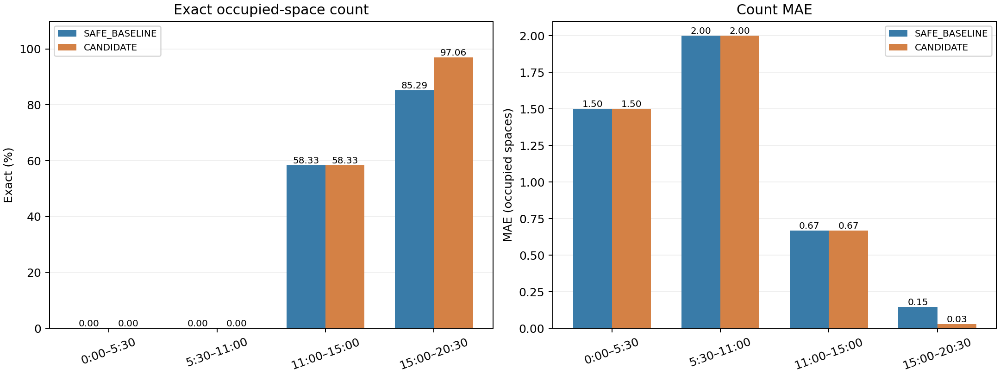
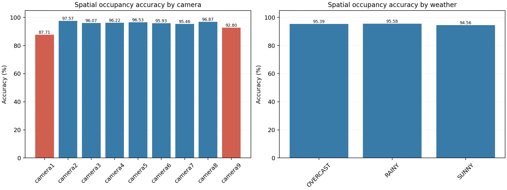
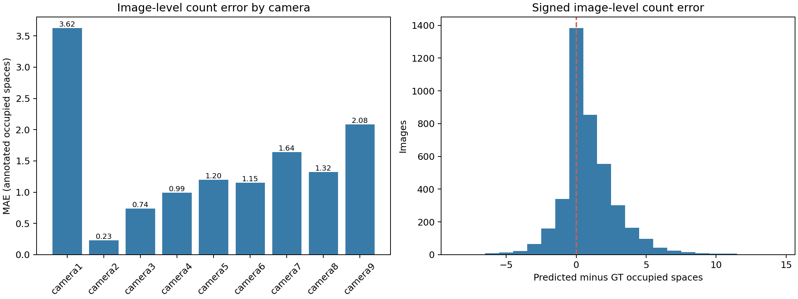
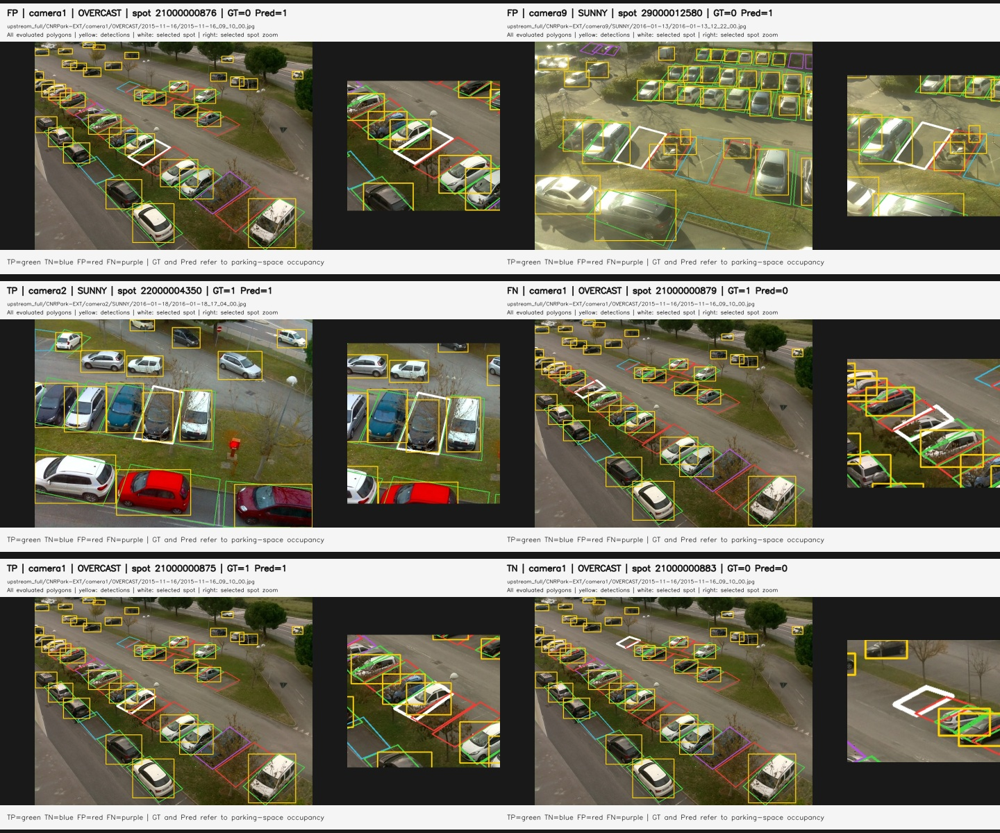
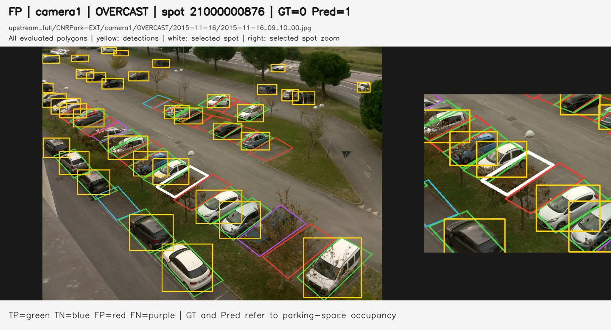
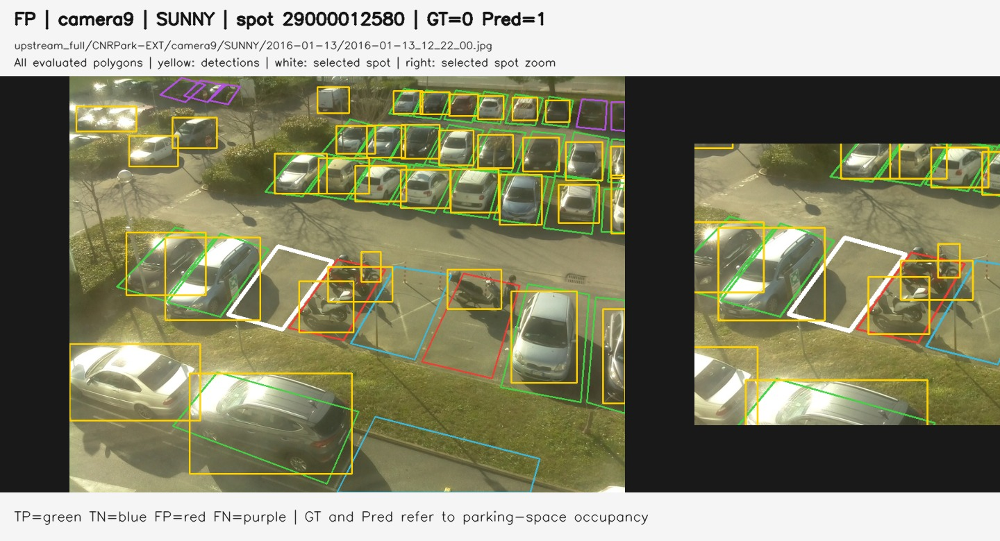
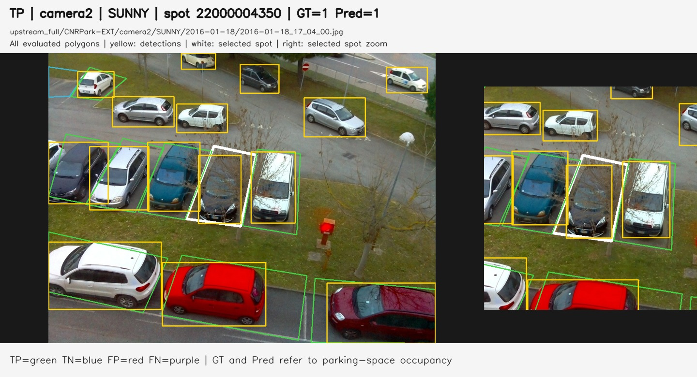

# 재촬영 다중 CCTV 영상의 인과적 주차면 점유 추정: Parking Research Agent Living Paper

Living Paper | v16.5.4 | Research revision temporal-external-windows-fresh-split-design-r4

[한국어](paper_v16.5.4_ko.md) | [English](paper_v16.5.4_en.md)

연구 초안. 시간 성능은 보존 연구 기록의 보고값이며, 외부 공간 결과는 원본 예측의 중복 제거 후 이번 코드로 재계산한 값이다. 전체 외부 추론을 다시 실행하지는 않았다. 저자·소속은 미기재 상태다.

<!-- section:abstract -->

## 초록

본 연구는 CCTV 모니터를 휴대전화로 재촬영한 영상에서 주차면 점유 수를 추정하는 연구 에이전트의 개발 과정을 정리한다. 흔들림, 원근 왜곡, 저해상도, 태양광 반사, 모니터 줄무늬와 차량 검출 누락이 동시에 존재하는 환경을 대상으로 한다. 수동 주차면 기준점, 원근 보정, Voronoi 기반 공간 제약, FULL 우선 검출과 선택적 AUX 복구, 인과적 시간 상태 추적을 결합한다. 보존된 연구 기록에서 v16.2 SAFE_BASELINE은 TEST Exact 85.29%, MAE 0.1471이며, 추적 ID 전환 시 입차 지연과 약한 출차 소유자 해제를 적용한 v16.4 CANDIDATE는 97.06%, MAE 0.0294이다. 다만 후보 규칙은 동일 검증 영상의 오류 분석 후 개발되었으므로 독립 일반화 성능으로 해석할 수 없다. CNRPark-EXT 외부 공간 평가에서는 9개 카메라·3개 날씨·4,073장 이미지의 보존 예측을 재계산했다. 중복 35,127행을 제거한 165,530개 고유 이미지–주차면 쌍에서 Accuracy 95.0770%, F1 95.4401%를 얻었다. 이미지별 점유 수 Exact는 33.9553%, MAE는 1.440953이다. 대표 20장 재추론은 보존 판정과 일치했다. 공간 결과는 시간 전이 일반화의 증거가 아니며, 기준 파라미터는 External Baseline으로 동결한다.

핵심어: 주차면 점유, CCTV 재촬영, 인과적 상태 추적, 다중 CCTV, 강건성, Living Paper.

보존 영상 다중 구간 재계산에서 Candidate의 이득은 4개 구간 중 마지막 구간에만 관측됐고, 전체 Exact는 SAFE 34.96%, Candidate 38.21%였다. 이는 구간별 안정성 평가이며 독립 검증이 아니다.

<!-- section:introduction -->

## 1. 서론

직접 디지털 CCTV 스트림을 확보하기 어려운 환경에서는 모니터 재촬영 영상이 연구 입력이 된다. 이때 검출 정확도를 높이는 것만으로는 차량이 어느 주차면에 대응하는지, 실제로 주차했는지, 출차했는지를 해결하기 어렵다. 같은 차량이 여러 CCTV에 보이는 경우에는 화면별 검출 수와 실제 점유 주차면 수를 구분해야 한다.

연구 질문은 세 가지다. (1) 수동 기준점을 유지하면서 약한 검출을 주차면에 안정적으로 대응시킬 수 있는가? (2) 미래 프레임 없이 주차 동작과 안정적 점유를 구분할 수 있는가? (3) 보존 영상에서의 개선을 새로운 영상과 열화 조건에서도 확인할 수 있는가? 본문은 공간 대응과 시간 상태 판단의 발전을 설명하고, 실패한 실험을 함께 보고하며, 독립 검증을 다음 단계로 명시한다.

<!-- section:related -->

## 2. 관련 연구와 연구 범위

Ultralytics YOLO의 객체 검출 추론 [R3]을 차량 관측 계층으로 사용한다. 본 연구의 비교 대상은 보존된 내부 버전이며, 다른 논문과 동일 프로토콜로 비교한 순위나 최첨단 성능을 주장하지 않는다. 전체 화면 검출, 주차면 crop, Hungarian 일대일 대응, 수동 기준점 공간 제약과 시간 상태 추적을 내부 실험으로 비교한다.

MetaPKLot [R4]은 기존 주차 데이터의 주석과 평가 체계를 제공한다. v16.5의 CNRPark-EXT 경로는 이미지별 주차면 점유 평가용이다. 이 구현의 공간 평가 결과를 연속 영상의 입차·출차 판정 결과로 대체할 수 없다. 외부 데이터셋은 목표 환경의 정답으로 튜닝하지 않는 검증 대상으로 유지한다.

<!-- section:environment -->

## 3. 연구 환경 및 문제 정의

초기 연구 입력은 CCTV 모니터의 휴대전화 재촬영 영상이다 [R1]. 원래 화면의 기울기와 사다리꼴 왜곡은 꼭짓점 4개 ROI로 보정한다. 가려진 주차선과 초기 만차 상태를 고려하여 주차면은 수동 기준점으로 정의한다. 서로 다른 화면에서 동일한 실제 주차면을 사용자가 GLOBAL SLOT으로 연결한다. 초기 설정은 3 CCTV이며 v16.5는 1-12 CCTV 프로필을 지원한다.

시각 t의 정답 점유 수를 y(t), 예측 수를 ŷ(t)라 하면 Exact는 평가 시점 중 y(t)=ŷ(t)의 비율이고 MAE는 |y(t)-ŷ(t)|의 평균이다. 점유 수, 고유 차량 수, CCTV별 수는 서로 다른 항목이다. 기술 상태 EMPTY, MANEUVERING, OCCUPIED, LEAVING, UNKNOWN과 SAFE_BASELINE/CANDIDATE 이름은 데이터 및 코드 호환성을 위해 그대로 유지한다.

> **그림 자리표시자 1. 실제 CCTV 모니터 재촬영 환경**
> 저장소에서 실제 이미지 파일을 확인하지 못했다. 향후 실행 결과의 GT review 또는 paper-ready 이미지를 검토하여 추가한다. 합성 사진이나 미검증 전후 결과로 대체하지 않는다.

> **그림 자리표시자 2. 수동 주차면 기준점과 원근 보정 및 Voronoi 영역**
> 저장소에서 실제 이미지 파일을 확인하지 못했다. 향후 실행 결과의 GT review 또는 paper-ready 이미지를 검토하여 추가한다. 합성 사진이나 미검증 전후 결과로 대체하지 않는다.

<!-- section:methods -->

## 4. 제안 방법

### 4.1 공간 대응과 FULL 우선 관측

ROI 원근 보정 후 YOLO 관측을 수동 기준점으로 고정한 Voronoi 영역과 대응한다. 학습 앵커는 기준점을 대체하지 않으며 이동 범위와 표본 조건으로 제한한다. 중복 검출 억제와 일대일 대응으로 동일 차량의 다중 주차면 할당을 줄인다. FULL 검출은 주 관측이다. 주 관측이 약하거나 누락되거나 외관 변화가 의심스러울 때, 또는 드문 점검 시점에 선택적 CROP/AUX를 호출한다. AUX는 FULL 누락을 복구할 수 있지만 유효한 FULL 관측을 지우지 못한다.

### 4.2 인과적 시간 상태

온라인 추적과 최근 10초 이력을 사용하여 주차 동작과 정지 점유를 구분한다. 첫 10초는 준비 구간이며 미래 프레임을 사용하지 않는다. 장기 정지 후보는 사용자 검토용이며 실제 주차면 수에 자동으로 추가하지 않는다. 캐시에서 학습 기하와 외관 템플릿 메타데이터를 함께 복원하고, 템플릿 누락이나 비현실적인 증거 분포는 거절 후 재계산한다.

### 4.3 추적 ID 전환과 출차 후보

v16.4 ENTRY_TRACK_SWITCH_HOLD는 ID가 바뀌어도 최근 주차면 움직임 맥락을 유지한다. 큰 움직임 직후 갑자기 정지로 보이는 새 추적은 충분한 시간 동안 안정화되기 전 OCCUPIED로 확정하지 않는다. LEAVING_WEAK_OWNER_RELEASE는 기준 엔진의 LEAVING 상태, 약한 소유자 평균 신뢰도, 유의미한 움직임, 연결 CCTV의 EMPTY 의견이 함께 있는 경우에만 유령 점유를 해제한다. 재획득 안정화 간격으로 즉시 재입차를 방지한다. 두 규칙은 CANDIDATE 후처리이며 SAFE_BASELINE을 자동 승격하거나 수정하지 않는다 [R2].

### 4.4 외부 공간 기준과 고유 표본

정지 이미지 공간 평가에는 동일한 검출·polygon 교차 판단을 사용하고 시간 상태 추적을 실행하지 않는다. annotation 변환과 평가 입력에서 경로 구분자를 정규화한 (image_path, spot_id)를 고유 키로 사용한다. 동일 키의 GT·polygon·예측이 충돌하면 첫 행을 임의로 선택하지 않고 평가를 중단한다. 폴더별 중복 수와 입력·고유 표본 수를 감사 기록에 남긴다. 이미지별 총량은 고유 주차면의 OCCUPIED 값을 합산하며, 주차면 밖 차량이나 카메라 간 고유 차량 총수와 구분한다. External Baseline은 최초 파라미터와 모델 해시를 저장하고 이후 설정 변경을 평가에 적용하지 않는다.

<!-- section:protocol -->

## 5. 실험 구성 및 근거 수준

보존 프로토콜은 15:00 이전 DEV로 파라미터를 선택하고, 선택 후 15:00-20:30 TEST를 평가한다. 전체 실험에서 최초 10초를 준비 구간으로 처리한다. 기록의 TEST 표본 수는 34개이며 인접 표본은 시간적으로 상관될 수 있다. Exact와 MAE 외에 최대 오차, 과소/과대 집계, 전이 이벤트별 지표를 구분한다.

이 문서의 수치는 research_history.json과 변경 기록에 보고된 결과를 정리한 것이다. 이번 문서 패치에서 원본 영상이나 전체 실행 결과를 확보하여 재실험하지 않았다. sample_ground_truth.csv는 참고 파일이며 원본 영상·실행 파라미터·전체 예측 파일을 대체하지 않는다. 재현 시 버전, 입력 해시, 설정, ROI, 슬롯, GT, DEV 선택 결과, TEST 예측, 캐시 검증과 실행 환경을 함께 보존해야 한다. v16.4 규칙을 동일 영상의 TEST 오류 분석 후 설계했으므로 TEST의 절대 수치를 미사용 holdout 결과로 표현하지 않는다.

외부 근거 [R6]는 사용자가 제공한 EXTERNAL_VALIDATION_TO_CHATGPT.zip과 일치하는 원본 예측 CSV다. 원본 ZIP, 예측, GT, 설정과 모델 해시를 보존했다. 전체 예측의 GT 일치와 중복 충돌을 검사한 후 변경하지 않은 예측에서 지표를 다시 산출했다. 원래 실행 당시의 별도 설정 snapshot은 없었으므로 현재 제공된 설정·원래 가중치로 대표 이미지 20장을 재추론했다. 선택한 이미지의 모든 점유 판정과 검출 수가 보존 예측과 일치하여 오버레이 증거로 사용했다. 4,073장 전체를 새로 추론한 것은 아니며, 이 결과는 동결된 예측의 공식 지표 재계산이다. 스크린샷은 오류 분석용 결정적 선택으로 무작위 표본이 아니다.

### 실제 DEV/TEST 재분할 실험 설계 (v16.5.4)

기존 저장 예측의 다중 구간 통계와 별개로, Original(DEV 0–900초 / TEST 900–1230초)과 Alternate(DEV 330–1230초 / TEST 0–330초)를 각각 새 프로세스에서 실행한다. 대체 구간은 변경 가능하되 겹치지 않아야 한다. 수동 기준점·초기 상태·사전 학습 YOLO 가중치·탐색 격자는 고정 입력으로 공유하고, 기존 검출기 선택·학습 폴더·캐시는 재사용하지 않는다. DEV 정답에 따른 검출기 설정 탐색, DEV 프레임의 앵커/템플릿 학습 및 품질 분위수 보정 후, DEV 정답만으로 시간 상태 변형을 선택한다. 슬롯 이벤트 정답은 선택에 전달하지 않는다. 이는 YOLO 가중치 재학습이 아니다.

선택 설정의 해시를 저장한 뒤 TEST 정답으로 SAFE_BASELINE, TRANSITION_GUARD, SEG_ASSIST, EMPTY_REF, SELECTED 및 CANDIDATE를 평가한다. 구간 시작은 포함, 끝은 제외하며 영상 평가 끝점만 포함한다. 기본 10초 초기 warm-up은 그대로 적용하고 분할 경계에서 상태를 초기화하지 않는다. 원래 학습기의 경계 프레임 포함 규칙과 달리 새 분할의 학습 프레임은 명시적 DEV 소속을 따른다. 전체 영상은 0초부터 시간 순서대로 추론하므로 이전 시점의 온라인 상태 이력은 구간을 가로질러 이어진다. 역방향 분할은 미래 DEV 영상으로 만든 템플릿을 앞쪽 TEST에 적용하는 오프라인 평가이며, 인과적 미래 예측 실험이 아니다.

v16.5.4에서 구현 및 기능 검증을 완료했으나 전체 실제 CCTV 재실험은 아직 수행하지 않았다. TEST 정답 교란 시 실제 상태 선택 설정의 불변성과 평가 수치 변화, 실제 검출기 탐색·주차면 학습의 DEV 프레임 접근, 경계·실패 처리를 검증했다. 구현 검증은 성능 증거가 아니다. 새로운 분할의 Exact/MAE는 미보고로 유지하며 기존 표의 수치는 갱신하지 않는다. 프로토콜 근거는 [설계 기록](../data/split_protocol_v1654.json), 실행 결과 형식은 split_final_metrics.csv와 split_audit.json이다. 과거에 검토한 동일 영상 구간을 재사용하므로 독립 검증으로 표현하지 않는다.

<!-- section:results -->

## 6. 실험 결과

표 1은 보존 기록의 버전별 점유 수 성능이다 [R1, R2]. MAE 반올림 정밀도는 원래 기록을 유지한다. v12와 v13은 Exact가 같아도 MAE와 최대 오차가 다르다. v16.2의 29/34와 v16.4의 33/34는 약 11.77%p 차이이며, MAE는 0.1471에서 0.0294로 낮아졌다. 두 방법 모두 최대 오차 1과 과소 집계 0%를 보고한다. 후보의 과대 집계는 2.94%이며 DEV 지표는 변하지 않았다는 기록이다.

새 현대 연속 영상의 시간 정확도는 미보고이다. CNRPark-EXT 공간 결과는 별도 분모와 표로 10절에 보고한다. 문서의 숫자를 새 실험 완료의 증거로 사용해서는 안 된다. 연구 원시 결과가 없는 초기 버전에는 수치를 부여하지 않는다.

| 버전/방법 | TEST Exact (%) | MAE | 최대 오차 | 근거 |
| --- | --- | --- | --- | --- |
| v7 | 82.35 | 0.3235 | - | retained_record |
| v8 | 32.35 | 1.294 | - | retained_record |
| v9 | 67.65 | 0.441 | - | retained_record |
| v10/v10.1 | 79.41 | 0.265 | - | retained_record |
| v12 FULL | 85.29 | ~0.206 | 2 | retained_record |
| v13 SAFE_BASELINE | 85.29 | 0.147 | 1 | retained_record |
| v16.2 SAFE_BASELINE | 85.29 | 0.1471 | 1 | retained_record |
| v16.4 CANDIDATE | 97.06 | 0.0294 | 1 | same_video_post_hoc |
| v16.5 external/new video | - | - | - | pending_at_v16.5_release |
| v16.5.1 | - | - | - | presentation_patch_no_new_measurement |
| v16.5.2 external spatial | - | - | - | separate_spatial_metrics_section_10 |

<!-- section:windows -->

## 6.1 보존 영상의 다중 구간 평가

v16.5.3은 검증 센터에서 여러 평가 구간을 지정하고 저장된 SAFE/Candidate 예측을 다시 비교한다. 새 학습·파라미터 선택·추론은 수행하지 않는다. 기본 구간은 0–330, 330–660, 660–900, 900–1230초와 전체다. 시작은 포함하고 끝은 제외하되 가장 큰 종료 시각은 포함한다. 상태는 원래 전체 영상의 연속 기록을 유지하며 각 구간 시작에서 다시 초기화하지 않는다. 최초 10초와 설정된 cut 이후 준비 구간, 유효하지 않거나 한 알고리즘의 예측이 누락된 표본은 공통 분모에서 제외하고 제외 개수를 기록한다.

2026-10-04 보존 실행의 두 count trace를 읽기 전용으로 복사하여 재계산했다. 첫 두 구간은 두 방법 모두 Exact 0%, MAE 각각 1.5와 2.0이다. 셋째 구간은 모두 Exact 58.33%, MAE 0.6667이다. 마지막 구간은 SAFE 85.29%/0.1471, Candidate 97.06%/0.0294로 기존 수치가 재현됐다. 개선 구간은 1/4이며 앞의 세 구간에서 이득은 관측되지 않았다. 전체 123개 표본의 Exact는 34.96%와 38.21%, MAE는 1.0976과 1.0650이다. 이는 97.06%를 영상 전체 성능으로 일반화할 수 없음을 보여준다. 첫 구간의 초기 상태 문제 가능성은 추가 분석이 필요하며 원인으로 확정하지 않는다.

전체 구간(ALL)은 표본을 한 번씩 집계한다. 구간별 Exact의 비가중 평균/모표준편차는 SAFE 35.91%/37.15%p, Candidate 38.85%/41.19%p이며 전체 표본 Exact와 다르다. 최저 구간은 두 방법 모두 W1, 최고는 W4다(동률은 최초 구간). 사용자 지정 겹치는 구간은 허용하되 summary에 표시하며 평균에 ALL을 넣지 않는다. 기존 DEV였던 앞부분과 오류 검토 후 개선한 마지막 구간을 포함하므로 독립 hold-out 검증이 아니다. 규칙은 동결하고 SAFE 승격은 수행하지 않는다.

### 공통 표본 기준 구간별 결과

| 구간 | N | SAFE Exact % | Candidate Exact % | Δ %p | SAFE MAE | Candidate MAE |
| --- | --- | --- | --- | --- | --- | --- |
| 0:00–5:30 | 32 | 0.00 | 0.00 | +0.00 | 1.5000 | 1.5000 |
| 5:30–11:00 | 33 | 0.00 | 0.00 | +0.00 | 2.0000 | 2.0000 |
| 11:00–15:00 | 24 | 58.33 | 58.33 | +0.00 | 0.6667 | 0.6667 |
| 15:00–20:30 | 34 | 85.29 | 97.06 | +11.76 | 0.1471 | 0.0294 |
| ALL | 123 | 34.96 | 38.21 | +3.25 | 1.0976 | 1.0650 |

그림 12. 보존 영상의 구간별 동결 예측 비교. 개선은 마지막 구간 1/4에만 관측된다.

<!-- section:failures -->

## 7. 실패 실험 및 절제 분석

표 2의 실험은 동일 목적을 향한 대안을 기록하지만 완전한 통제 절제 실험으로 간주하지 않는다. 버전별 조건과 추가 관측 비용이 달라 인과적 기여를 단일 숫자로 분리할 수 없다. CROP/HYBRID의 큰 회귀와 ZONE_MEMORY의 장기간 EMPTY 고착은 보조 관측과 기억이 주 관측을 대체할 때의 위험을 보여준다. TRANSITION_GUARD, SEG_ASSIST, EMPTY_REF는 안전 기준보다 낮아 채택하지 않았다. v15.1 분할은 약 7,451회의 추가 추론에도 상태 변경이 0회로 기록되어, 지연·선택적 분할을 개발하는 근거가 되었다.

원인 설명은 기록에 근거한 오류 해석이며 외부 데이터셋에서 검증된 일반 법칙이 아니다. 실패한 실험도 결과와 결정의 근거를 부록에 남긴다.

| 실험 | TEST Exact (%) | 관찰 | 출처 |
| --- | --- | --- | --- |
| CROP | 14.71 | FULL보다 불안정 | research_history.json:v11 |
| HYBRID | 23.53 | 채택하지 않음 | research_history.json:v11 |
| ZONE_MEMORY | 14.71 | 장기간 EMPTY 고착 | research_history.json:v14 |
| TRANSITION_GUARD | 70.59 | SAFE보다 낮아 거절 | research_history.json:v16.2 |
| SEG_ASSIST | 70.59 | SAFE보다 낮아 거절 | research_history.json:v16.2 |
| EMPTY_REF (EMPTY_REF_ASSIST) | 0 | SAFE보다 낮아 거절 | research_history.json:v16.2 |

<!-- section:transitions -->

## 8. 전이 오류 분석

v16.2의 TEST 오차 5개는 전이 이벤트 2개에 집중되었다. 입차 시 추적 ID가 바뀌면 움직임 이력이 초기화되어 조작 중 차량이 정지 차량으로 보일 수 있다. 출차에서는 약한 관측이 기존 소유자에 남아 실제 출차 후 점유가 지속될 수 있다. 후보는 주차면 수준 움직임 보존과 연결 CCTV EMPTY 의견을 이용해 두 유형을 제한적으로 보정한다.

기록상 이전 오차 5개 중 4개가 제거되었지만 17:00의 과대 집계 1개는 남았다. 프레임/시점 정확도가 높아져도 서로 상관된 전이 오류를 독립 성공 사례 여러 개로 계산할 수 없다. 이벤트별 입차 지연, 출차 지연, 거짓 점유 지속, ID 전환 빈도와 이벤트별 성공률을 별도로 보고해야 한다. 원시 CSV가 확보되기 전에는 미보고 전이 지연 수치를 추가하지 않는다.

> **그림 자리표시자 3. ID 전환 후 조기 OCCUPIED 및 유령 점유 오류**
> 저장소에서 실제 이미지 파일을 확인하지 못했다. 향후 실행 결과의 GT review 또는 paper-ready 이미지를 검토하여 추가한다. 합성 사진이나 미검증 전후 결과로 대체하지 않는다.

> **그림 자리표시자 4. 동일 시각 SAFE와 v16.4 Candidate 전후 비교**
> 저장소에서 실제 이미지 파일을 확인하지 못했다. 향후 실행 결과의 GT review 또는 paper-ready 이미지를 검토하여 추가한다. 합성 사진이나 미검증 전후 결과로 대체하지 않는다.

<!-- section:robustness -->

## 9. 영상 열화 강건성

강건성 실험은 LOW_RES, SUN_GLARE, MONITOR_STRIPES 조건을 다룬다. v15.3은 보수적 재샘플링/언샤프, 하이라이트 톤 압축, 과거·현재 5프레임의 인과적 temporal median을 도입했다. v15.4는 CCTV별 백분위 기반 상대 조건 분류와 지연 분할을 추가했다. v16 이후 GT 균형 보정, O/E/U 즉시 저장, U의 이진 지표 제외, Accuracy/Precision/F1/점유 Recall/빈 주차면 Specificity/FP/FN 평가와 표본 보정을 강화했다.

기록에는 temporal median의 stripe energy 감소와 검출 유지 개선이 정성적으로 남아 있지만 완전한 조건별 수치 표는 확보하지 못했다. 따라서 열화별 정확도 개선이나 외부 강건성 수치를 만들지 않는다. OCCUPIED에 치우친 GT와 일부 보충 검토 이미지의 패키징 누락은 한계다. 다음 실험은 조건별 O/E 표본 수, U 제외 수, 원본과 합성 열화 구분, RAW/ADAPTIVE 비용 및 상태 변화 효과를 함께 보고해야 한다.

> **그림 자리표시자 5. LOW_RES / SUN_GLARE / MONITOR_STRIPES의 RAW와 ADAPTIVE 비교**
> 저장소에서 실제 이미지 파일을 확인하지 못했다. 향후 실행 결과의 GT review 또는 paper-ready 이미지를 검토하여 추가한다. 합성 사진이나 미검증 전후 결과로 대체하지 않는다.

<!-- section:external -->

## 10. 외부 검증 및 반복 안정성 설계

### 10.1 독립 시간 검증 및 반복 안정성

검증 센터는 새 로컬 영상의 CCTV 수, GT와 장면 전환 후 준비 구간을 설정하여 episode_evaluation_mask.csv와 episode_metrics.csv를 생성한다. 반복 원본의 repeat_stability.csv는 상태 누적의 재현성과 안정성을 검사하며 독립 표본을 늘리지 않는다. 현대의 SAFE 85.29%/0.1471과 Candidate 97.06%/0.0294는 동일 보존 영상의 시간·전이 평가이다. 독립 연속 영상의 Candidate 승격 근거는 아직 확보되지 않았다.

### 10.2 CNRPark-EXT External Baseline

보존된 Full 실행의 200,657행에는 camera1 15,820행, camera4 19,307행이 중복되었다. 동일 annotation이 다른 압축 해제 폴더에서 읽힌 것이 원인이다. 이번 코드에서 35,127행을 제거해 4,073장, 9개 카메라, 3개 날씨의 고유 이미지–주차면 쌍 165,530개를 평가했다. 동일 키의 GT/예측 충돌은 없었다. 재계산된 Accuracy는 95.0770%, Precision 93.4883%, 점유 Recall 97.4751%, 빈 주차면 Specificity 92.3886%, F1 95.4401%, Balanced Accuracy 94.9319%다. TP/TN/FP/FN은 85,280/72,101/5,940/2,209이다. 이 결과를 보고 threshold를 조절하지 않았다.

### 10.3 주차면 분류와 이미지별 점유 수

이미지별 주차면 점유 수 Exact는 33.9553%, MAE 1.440953, 중앙 절대 오차 1, P90 4, P95 5, 최대 14다. 과대 집계 이미지 비율 51.0435%, 과소 15.0012%, Bias +0.916032다. 95.08% 주차면 분류와 33.96% 이미지 총량 Exact는 서로 다른 평가 단위이며 모순되지 않는다. 주차면 밖 차량까지 센 총 차량 수의 GT는 없으므로 이 값을 총 고유 차량 수 정확도로 표현하지 않는다.

### 10.4 카메라·날씨별 기술적 관찰

카메라 Accuracy 범위는 약 9.8594%p (camera1 87.7118%–camera2 97.5711%), 날씨 범위는 약 1.0253%p다. FP는 FN의 약 2.689배다. camera1은 FP/FN 1,758/186, Count MAE 3.623894와 Bias +3.477876이며 camera9는 1,054/148, MAE 2.084257와 Bias +2.008869이다. camera2는 Count Exact 79.6499%, MAE 0.229759이다. 실제 FP 사례의 이웃 차량 검출과 주차면 기하의 겹침은 오류 분석 가설을 제공한다. 카메라/날씨 그룹은 구성과 표본 분포가 서로 달라 이 차이로 기하의 인과 효과를 증명할 수는 없다. 추가 연구가 외부 결과에 맞춰 개선되면 별도 holdout에서 평가해야 한다.

표와 실제 그림은 [R6]의 CSV·해시·선택 이력에 연결되어 있다. montage는 camera1/camera9 FP, camera2 성공, TP/TN/FN을 함께 보여준다. 모든 실사진 패널에는 검출, 주차면 polygon, 선택 주차면 GT/Pred가 표시된다.

### 외부 공간 및 이미지별 집계 지표

| 지표 | 값 |
| --- | --- |
| Images | 4073 |
| Unique image/spot pairs | 165530 |
| Duplicate rows removed | 35127 |
| accuracy | 95.0770% |
| precision | 93.4883% |
| occupied_recall | 97.4751% |
| empty_specificity | 92.3886% |
| f1 | 95.4401% |
| balanced_accuracy | 94.9319% |
| TP | 85280 |
| TN | 72101 |
| FP | 5940 |
| FN | 2209 |
| count_exact | 33.9553% |
| count_mae | 1.440953 |
| count_median_abs_error | 1.000000 |
| count_p90_error | 4.000000 |
| count_p95_error | 5.000000 |
| count_max_error | 14.000000 |
| over_count_rate | 51.0435% |
| under_count_rate | 15.0012% |
| count_bias | 0.916032 |

### 카메라별 주차면 평가

| 카메라 | 주차면 표본 | Accuracy % | F1 % | Recall % | Specificity % |
| --- | --- | --- | --- | --- | --- |
| camera1 | 15820 | 87.71 | 90.24 | 97.97 | 73.57 |
| camera2 | 4570 | 97.57 | 98.11 | 99.07 | 94.93 |
| camera3 | 10396 | 96.07 | 96.46 | 94.74 | 97.79 |
| camera4 | 19307 | 96.22 | 96.52 | 97.93 | 94.25 |
| camera5 | 24970 | 96.53 | 96.69 | 97.66 | 95.30 |
| camera6 | 25025 | 95.93 | 95.92 | 95.80 | 96.06 |
| camera7 | 24115 | 95.46 | 95.52 | 97.59 | 93.36 |
| camera8 | 24640 | 96.87 | 97.08 | 98.42 | 95.12 |
| camera9 | 16687 | 92.80 | 93.42 | 98.30 | 86.83 |

### 날씨별 주차면 평가

| 날씨 | 주차면 표본 | Accuracy % | F1 % | Recall % | Specificity % |
| --- | --- | --- | --- | --- | --- |
| OVERCAST | 50367 | 95.39 | 95.60 | 98.18 | 92.49 |
| RAINY | 42858 | 95.58 | 95.49 | 98.07 | 93.32 |
| SUNNY | 72305 | 94.56 | 95.32 | 96.74 | 91.63 |

### 카메라별 이미지 점유 수

| 카메라 | 이미지 | Exact % | MAE | Bias | 최대 오차 |
| --- | --- | --- | --- | --- | --- |
| camera1 | 452 | 4.65 | 3.6239 | 3.4779 | 14 |
| camera2 | 457 | 79.65 | 0.2298 | 0.1247 | 2 |
| camera3 | 452 | 48.67 | 0.7367 | -0.4624 | 5 |
| camera4 | 449 | 40.31 | 0.9933 | 0.6726 | 6 |
| camera5 | 454 | 36.56 | 1.2004 | 0.5749 | 8 |
| camera6 | 455 | 33.63 | 1.1495 | -0.0725 | 6 |
| camera7 | 455 | 28.35 | 1.6418 | 1.1363 | 6 |
| camera8 | 448 | 27.90 | 1.3214 | 0.7991 | 7 |
| camera9 | 451 | 5.32 | 2.0843 | 2.0089 | 7 |

### 날씨별 이미지 점유 수

| 날씨 | 이미지 | Exact % | MAE | Bias | 최대 오차 |
| --- | --- | --- | --- | --- | --- |
| OVERCAST | 1240 | 34.52 | 1.4153 | 1.1169 | 12 |
| RAINY | 1053 | 35.42 | 1.4046 | 1.0513 | 14 |
| SUNNY | 1780 | 32.70 | 1.4803 | 0.6961 | 11 |

카메라별·날씨별 공간 점유 정확도

카메라별 점유 수 MAE 및 이미지별 부호 있는 집계 오차

실제 camera1·camera9 FP, camera2 성공 및 TP/TN/FN 사례

camera1 FP 사례: spot 21000000876, GT=0, Pred=1

camera9 FP 사례: spot 29000012580, GT=0, Pred=1

camera2 TP 사례: spot 22000004350, GT=1, Pred=1

<!-- section:history -->

## 11. 연구 이력의 통합 및 재현성

v1-v4는 검출과 안정화, 작은 판정 영역, 고해상도/타일 추론과 실행 빈도 최적화를 탐색했다. v4는 제안 중심의 부분 기록이며 확정 실험 수치가 없다. v5-v6은 기준점, 중복 연결, 원근 보정을 구축했다. v7-v10은 기준 평가, 실패한 학습 앵커, 수동 Voronoi 제약, 인과적 시간 추적으로 발전했다. v11-v14는 FULL/CROP/HYBRID 비교, 보조 관측 보호, 선택적 캐시 최적화와 실패한 기억 실험을 다뤘다. v15-v16.2는 전이와 분할·열화 조건, GT 균형, 증거 캐시 건전성과 회귀 점검을 강화했다. v16.3은 연구 이력/자동 업데이트 도구, v16.4는 전이 후보, v16.5는 검증 확대, v16.5.1은 UI 현지화와 이 문서 구조, v16.5.2는 중복을 제거한 외부 공간 검증 근거를 추가한다.

각 버전의 목표·변경·결과·문제·결정은 [전체 연구 이력 부록](../appendix/full_experiment_history.md)에 보존한다. 본문은 출시 순서가 아니라 방법·결과·오류·한계에 맞게 새 근거를 흡수한다. release ZIP과 SHA-256은 소스 배포 재현성을 지원하지만 입력 영상과 모델 가중치까지 자동으로 고정하는 것은 아니다.

v16.5.3은 동결된 예측의 다중 구간 비교와 실제 보존 영상의 구간별 한계를 추가한다.

<!-- section:limitations -->

## 12. 한계 및 향후 연구

가장 큰 한계는 단일 보존 영상, 작은 TEST 표본 수, 전이 시점의 시간 상관, 후보의 사후 오류 분석, 정량 근거가 불완전한 강건성 결과다. v16.5의 기능 구현은 새로운 데이터에서의 성공을 의미하지 않는다. 공개 이미지의 공간 검증만으로 시간 전이 안정성이나 현장 운영 안전성을 주장할 수 없다. 실패 실험의 수치도 조건이 완전히 동일한 절제 결과로 과해석하지 않는다.

향후 연구는 독립 연속 영상의 이벤트 균형 평가, O/E 균형 강건성 표본, 과소 집계와 거짓 점유 비용, 처리 시간과 캐시 재사용 비용, 카메라 수 및 시점 변화, 개인정보를 검토한 실제 전후 그림을 우선한다. 독립 검증 후에만 SAFE_BASELINE 승격을 논의하며, 성능이 회귀하면 후보로 유지하고 실패 근거를 남긴다.

외부 결과의 재계산은 기존 0/1 예측에 근거하며 전체 모델 추론 재실행과 구분된다. 원래 실행 설정 snapshot의 부재는 선택된 20장 재현으로 일부 점검했지만 전체 실행 설정의 완전한 복구를 증명하지는 못한다. 카메라와 날씨는 혼재된 조건이며 그룹 범위 비교는 기술적 관찰이다. camera1/9의 과점유와 전체 이미지 Count Exact 33.96%는 남은 한계다. 공간 외부 결과로 입출차 규칙의 일반화나 SAFE 승격을 주장하지 않는다.

다중 구간 결과는 마지막 구간 개선이 앞부분의 오차를 해결하지 못했음을 보인다. 보존 count trace의 비교이며 다른 영상에서 새로 실행한 실험이 아니다. 전체 실행 설정은 해시만 공개하고 로컬 영상 경로가 포함된 원본은 공개하지 않는다.

새 재분할 기능은 전체 영상 재실행 비용이 크며 결과는 미보고이다. 앞으로 실행 결과·입력 및 설정 해시·표본 수·실패 상태를 함께 검토한 뒤 본문 결과표에 통합해야 한다. 새로운 독립 영상 검증 없이 CANDIDATE를 승격하지 않는다.

<!-- section:conclusion -->

## 13. 결론

본 연구 기록은 수동 주차면 식별자를 보호하고 공간 제약과 인과적 시간 판단을 결합하며 보조 검출의 권한을 제한하는 방향으로 발전했다. 보존 영상에서 SAFE 85.29%에서 Candidate 97.06%로 개선되었지만 독립 시간 일반화는 미확인이다. CNRPark-EXT의 165,530개 고유 쌍에서 공간 Accuracy 95.0770%를 재계산했으며, 카메라별 FP와 이미지 총량 오차를 별도로 보고한다. 한·영 Living Paper는 동일한 연구 근거와 한계를 유지하고, 이후 릴리스에서 의미 있는 새 방법·표·그림을 적절한 본문 위치에 통합한다. 연구 변화가 없는 patch는 길이를 늘리지 않아도 된다.

<!-- section:references -->

## 참고 문헌 및 근거 자료

- [R1] [Canonical research history](https://github.com/sopo9880/Parking_/blob/3b8fe54bdcc2a08570fe84bbaace44347470b673/research_history.json), retained records v1-v16.5.
- [R2] [v16.4 change record](https://github.com/sopo9880/Parking_/blob/3b8fe54bdcc2a08570fe84bbaace44347470b673/CHANGES_v16_4.txt) and [v16.2 change record](https://github.com/sopo9880/Parking_/blob/3b8fe54bdcc2a08570fe84bbaace44347470b673/CHANGES_v16_2.txt).
- [R3] [Ultralytics YOLO prediction documentation](https://docs.ultralytics.com/modes/predict/).
- [R4] [DSBD-Research MetaPKLot dataset and evaluation resources](https://github.com/DSBD-Research/MetaPKLot-Dataset), accessed 2026-10-04.
- [R5] [v16.5 implementation record](https://github.com/sopo9880/Parking_/blob/3b8fe54bdcc2a08570fe84bbaace44347470b673/CHANGES_v16_5.txt).

- [R6] [Frozen external baseline, recalculated evidence and source hashes](../data/external_v1652/external_summary.json), [source package](../data/external_v1652/EXTERNAL_VALIDATION_TO_CHATGPT.zip), and [source/license attribution](../data/external_v1652/SOURCE_AND_LICENSE.txt), recomputed 2026-10-05.

- [R7] [보존 영상 다중 구간 근거](../data/windows_v1653/window_evaluation_summary.json), [예측 및 재계산 ZIP](../data/windows_v1653/WINDOW_EVALUATION_TO_CHATGPT.zip). 2026-10-05 재계산.
